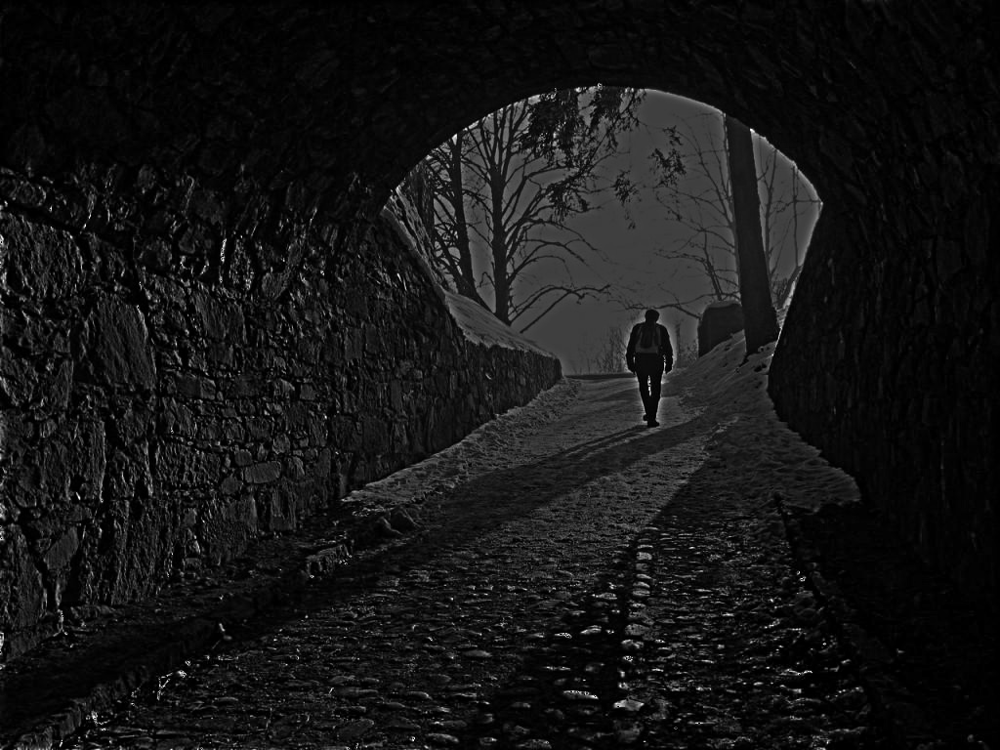

# Homomorphic Filter ChallengeIII
## Dependencies: 
  - The code is developed using **python** 
  - scipy, cv2, numpy, scipy, matplotlib.
## To run the code: 
  - Run **Main.py** file 
  - The original images and the result can be found in the **data** folder. 
  - If you want to test a new image, you can go to the the end of the code in the **Main.py** file and change the **path1** variable to the new image path.
  
## Results: 

 

      
     <em>Original Image</em>
 

  

      
     <em>Filtered Image</em>
 

